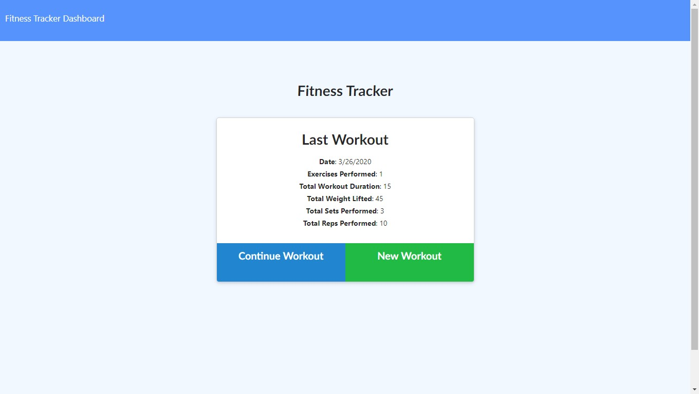
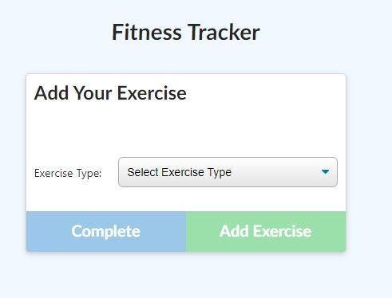
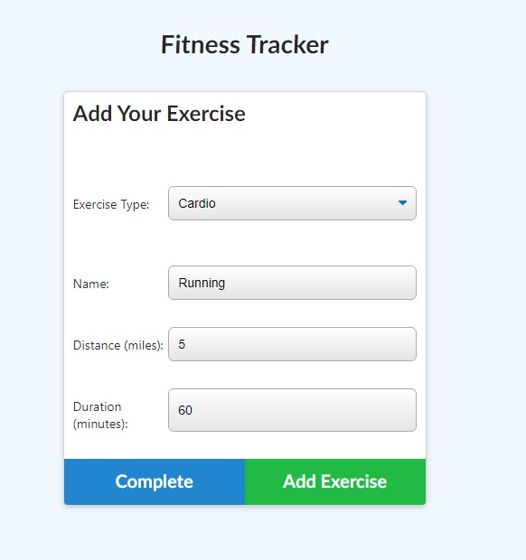
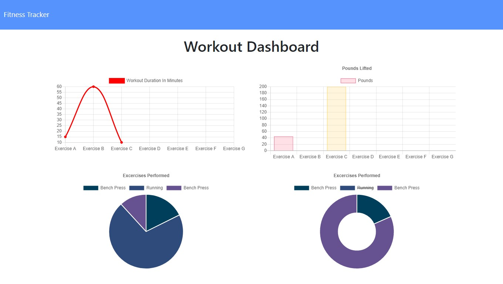

# Workout Tracking

## What it is

This is a web application that will allow users to track workouts across multiple workouts.

## Where it is

The live deployment is located here: <https://stormy-citadel-36854.herokuapp.com/>

## How to use it

This is application starts by displaying the basic information about the most recent workout.

To add an exercise to the current workout, click on the continue workout out button. This will bring up the exercise form.

Select the type of exercise and the relavent information for that type of exercise.

If there are any more exercises that you want to add after filling in the exercise information, click the 'Add Exercise' button. After the last exercise you want to add has been entered, click the 'Complete' button. Click either button only once, clicking more than once may result in extra exercises being added.

If you wish to return to the summary of your most recent workout click on the "Fitness Tracker" link at the top of the screen.

To see detailed stats of your workouts click on the "Dashboard" link at the top of  the screen.
